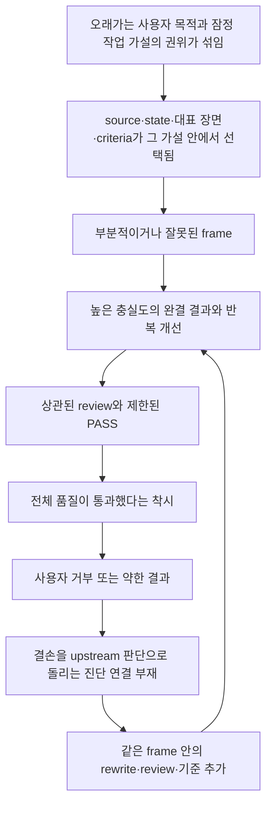

# Source 기반 문제 후보 지도

## 이 지도가 하는 일

이 문서는 기존 52개 원인 가설을 줄여 적은 수의 원칙으로 만드는 문서가 아니다. 실제 장면에서 서로 다른 손실을 만들고, 해결됐을 때 서로 다른 변화가 보여야 하는 문제들을 수거한다.

첫 수거에는 다음만 사용했다.

- [사용자 의도와 품질 신호](../material/01-user-intent-and-quality-signals.md)
- [관찰된 실패 장면](../material/02-observed-failure-scenes.md)
- [경쟁 원인 가설](../material/03-competing-causal-hypotheses.md)
- [Current·AX·Alex 교차 비교](../material/04-cross-case-comparison.md)
- [열린 질문과 미정의 개념](../material/05-open-questions-and-undefined-concepts.md)
- [분석 차원](../material/06-analysis-dimensions.md)
- [Alex 원본 지원 경계](../sources/alex-evidence-boundary.md)

과도하게 원자화했던 [첫 확장 기록](../references/atomic-element-expansion/)과 [구현 형식 카탈로그](../references/harness-form-catalog/)는 문제를 만드는 입력으로 사용하지 않았다. 첫째는 이 지도가 나온 뒤 coverage를 확인할 참고이고, 둘째는 문제 우선순위가 정해진 뒤 작동 방식과 owner를 비교할 참고다.

## 근거 상태

- `관찰 확인`: 입력, 행동, 결과의 전개가 보존 자료에서 확인된다.
- `사용자 판정`: 결과의 의미·품질·중심에 대해 사용자가 직접 내린 판단이다.
- `강한 인과 후보`: 여러 장면을 설명하지만 다른 원인과 분리 검증이 더 필요하다.
- `2차 문제`: 최초 실패보다, 그 실패를 고치려 만든 장치가 새 blind spot을 만든 문제다.
- `열린 경계`: 문제는 관찰되지만 일반화 범위나 최초 책임 위치가 아직 닫히지 않았다.

이 상태는 채택 순위가 아니다. 하나의 문제 안에도 확인된 전개와 미확정 인과가 함께 있을 수 있다.

## 전체 관계

아래는 모든 작업이 반드시 이 순서로 실패한다는 workflow가 아니다. 이번 장면들을 가장 적게 왜곡하면서 설명하는 현재 인과 후보다.

`state 압축`, `사용자 정정을 반대 방향 명령으로 읽는 것`, `탐색 중 조기 최소화`는 이 흐름의 한 칸이 아니라 여러 칸의 입력을 바꾸는 교차 문제다.

## I. 처음의 문제 정의와 frame을 만드는 문제

### 1. 오래가는 사용자 목적과 잠정 작업 가설이 같은 권위를 얻는다

**문제**

사용자가 작업을 시작한 이유, 이번 cycle의 목표, 현재 시험하는 중심, reviewer의 제안, 국소적으로 승인한 rewrite 방향이 구분되지 않으면 잠정 작업 가설이 사용자 목적처럼 다음 cycle 전체를 지배한다.

**관찰 근거**

- Current brief는 `current scaffolding`과 Q1~Q5를 보호할 중심으로 고정했고, worker는 이를 충실히 구현했지만 사용자는 발생 이유와 자신의 판단이 없다고 판정했다. [관찰 장면 10](../material/02-observed-failure-scenes.md#장면-10--current-재작성은-합의된-brief를-충실히-수행하고-여러-검토를-통과했지만-사용자는-핵심-동기가-없다고-판정했다)
- A와 B는 다른 구조와 기준을 사용했지만 같은 최근 사건 universe를 유지했다. 이 관찰은 권위 혼합을 직접 증명하기보다 잠정 작업 가설이 다음 판단들에 계속 유지됐다는 정황을 보탠다. [관찰 장면 14](../material/02-observed-failure-scenes.md#장면-14--a와-b는-다른-기준으로-다른-답을-냈지만-같은-최근-장면을-대표-문제로-공유했다)
- 사용자는 현재 판단도 상황에 따라 바뀔 수 있고, reviewer의 제안이나 main의 선택이 자동으로 합의가 되어서는 안 된다고 반복해서 정정했다. [사용자 의도 3~5](../material/01-user-intent-and-quality-signals.md#3-애매한-의미와-권한은-ai가-편의상-닫지-말고-사용자와-맞추기를-원했다)

**손실**

source 선택, worker brief, reviewer 질문, main 회수가 모두 같은 잠정 가설을 재생한다. 실행 품질이 높아져도 원래 목적에 가까워지지 않을 수 있다.

**인접 문제와의 경계**

- top-level goal이 애초에 없었던 경우와 다르다.
- 사용자가 결과를 보며 목적을 새로 발견하거나 바꾼 경우와도 다르다.
- 명료한 goal 문장을 하나 더 쓰면 해결된다고 아직 말할 수 없다.

**해결됐다고 볼 변화**

새 작업자가 사용자 목적, 이번 cycle의 목표, 현재 가설, 성공 조건, 국소 합의의 승인 범위를 구분하고, 결과가 어긋날 때 어느 것을 보존하고 어느 것을 다시 열지 판단할 수 있다.

**상태와 전이**

`관찰 확인 + 사용자 판정 + 강한 인과 후보`. Current에서는 근거가 강하다. AX는 top-level goal과 loop goal을 구분한 대조를 주지만, `current`가 있어도 최근 loop가 중심을 대신한 반례가 있다. Alex 원본은 solution scope와 평가 조건 변경만 지원하며 top-level problem 변경은 지원하지 않는다.

### 2. 존재하는 source와 material이 실제 판단에서 작동하지 않는다

**문제**

source가 저장돼 있거나 AI가 읽었다는 사실과, 그 source가 state·packet·중심 선택·결과·평가 질문에서 실제 권위를 가진 것은 다르다. 이 경로 중간에서 역할이 사라지면 존재하는 material도 결과에는 없는 것처럼 작동한다.

**관찰 근거**

- Current의 최초 동기와 긍정적 효용 material은 이미 있었는데 최종 원고의 인과와 중심에서 사라졌다. [관찰 장면 10~11](../material/02-observed-failure-scenes.md#장면-10--current-재작성은-합의된-brief를-충실히-수행하고-여러-검토를-통과했지만-사용자는-핵심-동기가-없다고-판정했다)
- A/B source packet에는 Q1~Q5와 최근 사건은 있었지만 current가 처음 필요해진 문제와 Alex 발상 계보는 없었다. [관찰 장면 13](../material/02-observed-failure-scenes.md#장면-13--sourceresult-improvement-review를-새로-정의했지만-공통-source-packet은-기존-frame-안에서-골라졌다)
- active-state가 완료된 가지를 너무 낮은 해상도로 줄이자 다음 session은 이미 있던 material을 다시 찾지 못했다. [관찰 장면 9](../material/02-observed-failure-scenes.md#장면-9--첫-active-state가-최신을-직전-단계로-축소해-완료된-가지의-현재-의미를-잃었다)

**손실**

동기·저자 판단·긍정적 효용이 결과에서 빠지고, reviewer는 기존 결과를 설명하는 source만으로 개선안을 만든다. 이후 `material이 없었다`는 잘못된 진단까지 생긴다.

**인접 문제와의 경계**

다음은 결과 모양이 비슷하지만 최초 책임 위치가 다르다.

- source가 애초에 없었다.
- state에서 현재 의미를 잃었다.
- task input에 전달되지 않았다.
- 전달됐지만 중심을 바꿀 권위를 얻지 못했다.
- 기존 결과 frame을 기준으로 packet 자체가 선택됐다.

현재 자료는 state 소실, task input 누락, 기존 결과를 기준으로 한 packet 선택을 비교적 강하게 지지한다. 전달된 source가 중심을 바꿀 권위를 얻지 못했다는 설명은 중간 강도의 가설이다. 어느 하나도 단일 원인으로 확정하지 않으며, Alex 영감이 최초 글감 형성 당시 기록돼 있었는지도 미확인이다.

**해결됐다고 볼 변화**

중요한 source가 목록에만 존재하지 않고, 어떤 판단에서 사실·동기·중심·장면·평가 근거 중 어느 역할을 하는지 결과와 후속 판정에서 확인된다.

**상태와 전이**

material 존재와 결과 누락은 `관찰 확인 + 사용자 판정`; 정확한 소실 위치는 `강한 인과 후보`. 장기 source 기반 조사와 multi-agent 작업에 전이 가능성이 높지만, 모든 reviewer에게 모든 source를 주어야 한다는 뜻은 아니다.

### 3. 측정·검증하기 쉬운 결과 proxy가 실제 가치와 인과 경로를 대신한다

**문제**

근거량, 숫자, 최근 사건, fixture 통과처럼 명료하고 검증하기 쉬운 결과 proxy가 사용자에게 중요한 효용이나 실제로 바꾸려는 상태보다 선택 우위를 얻는다.

**관찰 근거**

- 글감 탐색에서 근거량·초안 준비도·참고 서사 패턴이 후보 가치 판단을 대신했다. [관찰 장면 1~2](../material/02-observed-failure-scenes.md#장면-1--보조-기준이-글감-탐색의-상위-목적을-대신했다)
- Q1~Q5가 Current의 발생 이유와 긍정적 효용보다 반복해서 중심이 된 것은 확인된다. 구체적이고 증명하기 쉬운 장면이어서 선택 우위를 얻었다는 설명은 경쟁 원인 가설이다. [사용자 의도 10](../material/01-user-intent-and-quality-signals.md#10-a는-더-생생했지만-a와-b-모두-같은-틀에-갇혔다고-판단했다), [경쟁 가설 7](../material/03-competing-causal-hypotheses.md#가설-7--증명하기-쉬운-장면이-중요한-경험보다-선택-우위를-가졌다)
- AX에서는 9개 fixture test 통과가 설치된 자연어 제품 계약의 통과를 대신하지 못했다. [교차 비교의 AX 사례](../material/04-cross-case-comparison.md#ax-프로젝트의-실제-current와-loop)

**손실**

결과는 구체적이고 검증 가능하지만, 사용자가 실제로 중요하게 느낀 효용·전체 맥락·핵심 causal path가 약해진다. 성공과 실패가 공존한 계보도 증명하기 쉬운 실패 한 장면으로 재작성될 수 있다.

**인접 문제와의 경계**

- 근거를 엄격하게 다루는 것 자체가 문제는 아니다.
- 범위를 줄였다는 사실보다, 줄인 뒤에도 보존돼야 할 상태 변화와 인과 경로가 쉬운 대체물로 바뀌었는지가 핵심이다.
- 문제 4가 criteria·constraint가 후보 생성 전에 가능성 공간을 같은 모양으로 만드는 문제라면, 이 문제는 결과·지표·검증 가능성이 실제 가치의 측정 proxy가 된 문제다.
- 글쓰기의 저자성은 구현 사례에 그대로 일반화하지 않는다.

**해결됐다고 볼 변화**

후보 가치, 증거 준비도, 주장 상한, test 통과, 다음 작업 순서가 서로 대신하지 않는다. scope를 바꾼 뒤에도 원래 바꾸려던 사용자·제품·판단 상태가 결과에서 이어진다.

**상태와 전이**

Current의 proxy 우위는 `강한 인과 후보`, AX의 fixture/product-contract 차이는 `관찰 확인`. Alex의 짧은 시간·리소스 constraint가 작은 solution을 유도했다는 설명은 확인되지만 통제된 인과 증명은 아니다.

### 4. 좋은 criteria와 constraint가 후보 생성 전에 가능성 공간을 닫는다

**문제**

사실 상한, 한 중심, 범위 제한, 독자 진입성처럼 유효한 기준도 탐색·생성·평가·수렴 중 어디에서 어떤 결정을 닫을 수 있는지 구분하지 않으면 후보가 만들어지기 전부터 같은 모양의 결과를 유도하는 anchor가 된다.

**관찰 근거**

- `한 편은 한 중심 질문`, claim ceiling, evidence readiness가 material 탐색 전에 적용돼 후보 가치와 가능성을 닫았다. [관찰 장면 2](../material/02-observed-failure-scenes.md#장면-2--다음-작업-cursor가-후보-가치-서열로-변했다)
- global editorial core와 lenses를 적용한 B에서도 보호된 중심과 source frame은 결과적으로 다시 열리지 않았다. 기준 부족, 적용 범위, goal·source frame을 열 권한 부족 가운데 무엇이 원인이었는지는 아직 경쟁 중이다. [사용자 의도 11](../material/01-user-intent-and-quality-signals.md#11-b가-global-core와-lenses를-썼는데도-전진하지-못한-이유를-더-근본적으로-알고-싶어-했다)
- Alex는 자신의 resource guardrail이 작은 solution을 유도했다고 판단해 scope 기대와 평가 압력을 바꿨다. [Alex 확인 범위](../sources/alex-evidence-boundary.md#4-결과만-고치지-않고-자신이-준-제약을-의심한다)

**손실**

유효한 guard와 lens가 문제를 막는 데 그치지 않고 가능한 결과의 야심·중심·형태를 조용히 결정한다. 기준을 더 추가해도 같은 frame의 방어력만 커질 수 있다.

**인접 문제와의 경계**

- criteria가 실제로 부족했던 문제와 조기·과잉 적용 문제는 반대 처방을 만들 수 있다.
- 기준 내용의 품질과 기준이 판단을 닫는 시점·권한은 다르다.
- 문제 3의 measurement proxy와 달리, 여기서는 평가에 쓰려던 기준이 생성 전에 후보 공간을 닫은 것이 핵심이다.
- Alex의 virality, visual appeal, 1~2주 scope는 일반 기준이 아니라 해당 해커톤에 묶인 세부값이다.

**해결됐다고 볼 변화**

같은 기준이 어느 시점에는 hard guard, 어느 시점에는 비교 질문, 어느 시점에는 수렴 조건인지 구분된다. 하나의 기준 통과·실패가 다른 품질축이나 후보 전체의 가치를 자동으로 대신하지 않는다.

**상태와 전이**

Current에서는 `관찰 확인 + 강한 인과 후보`. 구현·제품 discovery에도 전이 가능하지만, constraint 완화가 실제 가치 향상인지 단지 더 화려한 결과인지 판별할 외부 근거가 필요하다.

### 5. 현재 상태를 압축하고 명료하게 만드는 과정이 판단 권위를 바꾼다

**문제**

`현재`를 직전 단계로 축소하거나, 명료한 문장과 상태만 남기면 완료됐지만 여전히 유효한 가지·모호한 사용자 기억·긍정적 효용은 약해지고 최근 작업 가설은 현재 truth처럼 보일 수 있다.

**관찰 근거**

- 첫 active-state는 최신을 직전 단계로 축소해 조사·후보 형성·첫 shaping·사용자 중심 합의의 현재 의미를 잃었다. [관찰 장면 9](../material/02-observed-failure-scenes.md#장면-9--첫-active-state가-최신을-직전-단계로-축소해-완료된-가지의-현재-의미를-잃었다)
- fresh pass에서 기존 backlog와 합의가 밀리고 reviewer 제안과 main 임시 선택이 사용자 합의처럼 굳었다. [관찰 장면 3](../material/02-observed-failure-scenes.md#장면-3--첫-v1v3-loop는-많은-것을-개선했지만-사용자-중심도-함께-이동시켰다)
- AX의 `current`는 생애주기와 cursor를 보존했지만 최근 Loop 01 중심화와 terminal event 미반영 반례도 있었다. [교차 비교](../material/04-cross-case-comparison.md#4-현재-상태-외부화와-현재-상태의-정당성은-다르다)

**손실**

다음 AI는 오래된 결정을 다시 추론하거나, 반대로 잠정 가설을 확정된 합의로 이어받는다. state가 동기와 source를 연결하는 장치가 아니라 잘못된 frame의 안정화 장치가 될 수 있다.

**인접 문제와의 경계**

단순히 context가 많거나 적은 문제가 아니다. 무엇이 현재 판단에 여전히 유효한지, 누가 어떤 권한으로 정했는지 복원되지 않는 문제다. 모든 결정에 상세 provenance를 붙이면 다시 운영 부담이 커질 수 있다.

**해결됐다고 볼 변화**

완료된 가지도 현재 판단에 필요하면 낮은 해상도로 남고, 새 session이 사용자 합의·작업 가설·reviewer 제안·보류 후보를 구분한다. current가 존재한다는 사실만으로 정당성과 최신성이 통과하지 않는다.

**상태와 전이**

`관찰 확인 + 2차 문제`. 장기 AI 협업에는 전이 가능성이 높지만, 짧고 상태가 명확한 one-shot 작업까지 같은 구조를 요구할 근거는 없다.

## II. 잘못된 frame을 더 완성하고 통과시키는 문제

### 6. 높은 실행 충실도와 완결성이 잘못된 frame을 더 자연스럽게 만든다

**문제**

worker가 brief를 정확히 따르고 결과가 완결될수록 그 결과 안의 구조·문장·사실은 좋아질 수 있다. 그러나 upstream frame이 틀렸다면 높은 완성도는 오류를 제거하지 않고 더 납득 가능한 형태로 만든다.

**관찰 근거**

- v1→v3는 사실·주장 상한·review 분리를 개선했지만 사용자 중심과 살아 있는 material도 이동시켰다. [관찰 장면 3](../material/02-observed-failure-scenes.md#장면-3--첫-v1v3-loop는-많은-것을-개선했지만-사용자-중심도-함께-이동시켰다)
- post-sync와 near-final은 더 높은 사용자 판정에서 뒤집혔다. public reshape도 완결본과 여러 review 뒤 verdict가 닫히지 않았고, 그중 Current가 후속 사용자 판정에서 다시 뒤집혔다. [장면 사이의 반복 관찰](../material/02-observed-failure-scenes.md#장면-사이에서-반복되는-관찰)
- Current worker의 높은 brief 충실도와 A 후보의 structural fidelity `PASS`는 brief 자체의 적절성을 통과시키지 않았다. [관찰 장면 10·14](../material/02-observed-failure-scenes.md#장면-10--current-재작성은-합의된-brief를-충실히-수행하고-여러-검토를-통과했지만-사용자는-핵심-동기가-없다고-판정했다)

**손실**

같은 frame 안의 rewrite·polish·review가 path dependence를 키우고, 이미 많은 작업이 들어갔다는 사실이 중심을 다시 여는 비용을 높인다.

**인접 문제와의 경계**

최초 frame 오류의 원인은 아니다. 문제 1~5에서 생긴 frame을 증폭하는 메커니즘이다. 완결 결과를 만드는 것 자체도 문제는 아니며, 사용자는 충분히 온전한 결과를 보고 전체 품질을 판단하는 방식을 선호한다.

**해결됐다고 볼 변화**

완결성은 전체 인상을 관찰하게 하지만 acceptance나 upstream 판단의 정당성을 자동 통과시키지 않는다. 반복 결과가 같은 종류로 어긋날 때 다음 iteration이 표현 개선만으로 이어지지 않는다.

**상태와 전이**

반복 cycle은 `관찰 확인`, 고충실도가 frame을 강화한다는 인과는 `강한 인과 후보`. “실행 품질이 높을수록 항상 위험하다”는 일반 법칙은 아니다.

### 7. 판별자 수와 판단 독립성을 혼동해 오류 상관을 끊지 못한다

**문제**

다른 agent, blind review, editorial lens가 있어도 source universe·대표 장면·질문·기각 권한·main 회수 방식이 같으면 서로 다른 오류를 보지 못할 수 있다.

**관찰 근거**

- draft-only reviewer는 first-read 품질은 볼 수 있었지만 source 누락과 goal mismatch를 볼 입력이 없었다. [관찰 장면 12](../material/02-observed-failure-scenes.md#장면-12--결과물만-본-독립-판별의-제한이-뒤늦게-완료-신호로-확대된-것이-확인됐다)
- source+result review는 정보를 보강했지만 packet에는 Current·Q1~Q5·terminal gap이 포함되고 최초 motive와 Alex 계보는 빠졌다. packet이 기존 frame 안에서 선택됐다는 설명은 강한 인과 후보다. [관찰 장면 13](../material/02-observed-failure-scenes.md#장면-13--sourceresult-improvement-review를-새로-정의했지만-공통-source-packet은-기존-frame-안에서-골라졌다)
- A/B는 다른 기준과 verdict에도 같은 사건 universe를 공유했다. [관찰 장면 14](../material/02-observed-failure-scenes.md#장면-14--a와-b는-다른-기준으로-다른-답을-냈지만-같은-최근-장면을-대표-문제로-공유했다)
- AX의 fresh evaluator는 fixture 세계와 다른 설치형 자연어 계약을 보며 실제로 다른 오류를 발견했다. [교차 비교](../material/04-cross-case-comparison.md#3-같은-frame의-반복-판정은-오류를-더-자연스럽게-만들-수-있다)

**손실**

review 수와 verdict 다양성은 늘지만 실제 후보 공간과 문제 정의는 넓어지지 않는다. main이 새 관찰을 기존 언어로 회수하면서 독립성이 다시 사라질 수도 있다.

**인접 문제와의 경계**

- 정보가 적을수록 독립적인 것은 아니다.
- first reader, fact verifier, source+result reviewer, frame을 문제 삼는 판별은 서로 다른 질문을 맡는다.
- reviewer가 틀렸다는 문제가 아니라 주어진 판정 위치가 전체 오류를 볼 수 없었다는 문제다.

**해결됐다고 볼 변화**

서로 다른 판별이 agent 이름이 아니라 끊어야 할 오류 상관으로 구분되고, 제한된 역할은 보지 못한 범위를 명시한다. main이 관찰과 채택을 분리해 회수한다.

**상태와 전이**

A/B의 공통 packet과 제한된 review 범위는 `관찰 확인`; 오류 상관 설명은 `강한 인과 후보`. Alex의 fresh reviewer와 Evaluation Foundation은 계획만 확인되며 실행 성공 근거로 쓰지 않는다.

### 8. 제한된 PASS와 완결 상태가 전체 수용·완료로 확대된다

**문제**

사실, 구조, 공개 경계, 원고 자립성, fixture처럼 특정 질문의 통과가 목적 적합성·매력·제품 계약·사용자 수용까지 통과한 것으로 읽히면 verdict가 판정 범위를 넘어선다.

**관찰 근거**

- near-final review와 prepublish를 통과한 다섯 글은 사용자가 공개 블로그 글로 읽은 뒤 다시 reshape 대상이 됐다. [관찰 장면 6](../material/02-observed-failure-scenes.md#장면-6--near-final-v2v3는-여러-review와-prepublish를-통과했지만-공개-블로그-품질-판정은-뒤집혔다)
- Current의 draft-only `light edit` 판정은 motive와 source 누락을 볼 수 없는 입력에서 나왔다. [관찰 장면 12](../material/02-observed-failure-scenes.md#장면-12--결과물만-본-독립-판별의-제한이-뒤늦게-완료-신호로-확대된-것이-확인됐다)
- AX의 fixture green과 설치된 자연어 E2E 통과는 다른 상태였다. [교차 비교](../material/04-cross-case-comparison.md#ax-프로젝트의-실제-current와-loop)

**손실**

사용자 전체 품질 판정이 늦게 들어와 큰 재작업이 반복되고, 제한된 reviewer의 유효한 판정까지 사후에 잘못된 평가처럼 보일 수 있다.

**인접 문제와의 경계**

artifact completeness, evaluation completeness, user acceptance, external verification은 같은 상태가 아니다. reviewer가 주어진 범위에서 오판했다는 뜻도 아니다.

**해결됐다고 볼 변화**

각 verdict가 통과시킨 범위와 보지 못한 범위를 함께 보존한다. 하나의 PASS나 `near-final` 라벨만으로 전체 결과를 닫지 않는다.

**상태와 전이**

`관찰 확인 + 2차 문제`. 글쓰기와 구현 모두에 대조 근거가 있다. Alex의 concept report는 방향을 판단한 probe일 뿐 최종 구현 품질의 PASS가 아니다.

## III. 약한 결과와 사용자 거부 뒤에도 올바른 판단 위치로 돌아가지 못하는 문제

### 9. 결과의 결손을 어느 upstream 판단으로 돌릴지 판별하는 연결이 없다

**문제**

결과가 약할 때 문장·기능·구조를 고칠지, 대표 장면·source·작업 가설·constraint·criteria·review 계약 중 무엇을 다시 열지 구분하지 못하면 익숙한 수정이나 전체 재실행으로 돌아간다.

**관찰 근거**

- Current의 동기 누락 뒤 assistant는 실제 process를 확인하기 전에 `Material 생략`을 원인으로 골랐다. [관찰 장면 11](../material/02-observed-failure-scenes.md#장면-11--assistant는-사용자-거부-뒤-material-생략을-원인으로-너무-빨리-골랐다)
- 사용자는 `Material로 돌아간다`보다 goal·criteria·evaluator·loop까지 경쟁 설명으로 열라고 했다. [관찰 장면 15](../material/02-observed-failure-scenes.md#장면-15--사용자는-material로-돌아간다보다-더-일반적인-판단을-요구했다)
- AX는 fresh E2E 결과를 이용해 artifact 결함과 evaluation contract를 함께 고친 대조를 제공한다. Alex는 약한 concept 뒤 자신의 constraint와 평가 조건을 바꿨다. [교차 비교](../material/04-cross-case-comparison.md#2-결과-보정과-생성-조건-보정은-다르다)

**손실**

이미 수행한 단계를 반복하고, 같은 frame 안에서 rewrite·review·criteria 추가가 이어진다. 모든 단계를 처음부터 다시 해도 같은 전제를 더 오래 반복할 수 있다.

**인접 문제와의 경계**

- `Material` 같은 단계 이름은 원인 위치가 아니다.
- 결과 결손 하나가 항상 upstream 문제라는 뜻도 아니다. 명확한 local defect는 국소 수정으로 끝날 수 있다.
- 어느 신호에서 상위 판단을 다시 열어야 비용 대비 유효한지는 아직 열려 있다.

**해결됐다고 볼 변화**

완결 결과를 본 뒤 가장 큰 간극, 간극이 생긴 최초 결정 위치, 다음 iteration에서 다시 열 것과 보호할 것이 구분된다. 원인이 불명확할 때만 필요한 별도 판단을 연다.

**상태와 전이**

조기 `Material` 진단은 `관찰 확인 + 사용자 판정`; upstream routing 부재가 반복 rewrite의 원인이라는 설명은 `강한 인과 후보`. 이 문제는 Current 한 편보다 넓게 전이될 가능성이 크지만 Current 밖 사례 검증이 더 필요하다.

## 여러 문제를 잇는 2차 관계

### 실패를 고치려 만든 장치가 자기 역할을 넘어 새로운 blind spot을 만든다

**문제**

context 혼합, main bias, source 부족, 기준 누락 같은 이전 실패를 고치려 만든 장치가 제한된 역할을 넘어 전체 해결책이 되면 반대쪽 손실을 만든다.

**관찰 근거**

- context 혼합을 줄이려 active-state를 압축했더니 완료된 가지와 motive가 사라졌다.
- main frame을 피하려 draft-only blind review를 했더니 source 누락과 goal mismatch를 볼 수 없었다.
- source를 추가한 improvement review는 packet 선택자의 frame에 종속됐다.
- lens를 더 적용한 B는 보호된 중심을 더 정교하게 만들었다.
- 단계 taxonomy는 `Material 생략`이라는 빠른 오진을 만들었다.
- 충분한 확장을 보장하려 만든 첫 `src`는 84개 요소의 부품 카탈로그가 됐다. 이 마지막 장면은 현재 workspace의 [active-state](../active-state.md#현재-지도)가 소유한다.

앞의 다섯 장면은 [관찰 장면 8~14](../material/02-observed-failure-scenes.md#장면-8--context-구조를-만들며-assistant가-과도한-구조화와-평평한-복사-사이를-오갔다)에 이어져 있다.

**손실**

문제는 사라지지 않고 다른 층위에서 재발한다. 장치가 많아질수록 하네스 수행과 관리 자체가 일이 되고, 실패 원인은 각 장치의 부재로만 설명된다.

**인접 문제와의 경계**

이 관계는 최초 frame 오류를 설명하지 않는다. 문제 2·4·5·7·8·9·10을 잇고, 최초 교정 뒤 왜 실패가 다른 모양으로 재발했는지를 보여 준다. 각각의 장치가 무용하다는 뜻도 아니다.

**해결됐다고 볼 변화**

교정 뒤 새 손실이 나타났을 때 최초 문제와 2차 효과를 분리해 관찰할 수 있고, 같은 장치를 더 강하게 반복하는 것이 자동 기본값이 되지 않는다.

**상태와 전이**

active-state 압축과 draft-only review의 2차 효과는 `관찰 확인`에 가깝다. lens, 단계 taxonomy, 84개 원자화까지 하나의 공통 인과로 묶는 것은 `강한 인과 후보`다. state compression, test suite, code review, scope guardrail, taxonomy로의 전이도 사례별 검증이 필요하다.

## IV. 수거·참고·학습 과정에서 다시 생긴 문제

### 10. 최종 운영을 가볍게 하려는 요구가 탐색 재료까지 일찍 줄인다

**문제**

무거운 고정 workflow를 피하려는 요구와, 후보·반례·원인 가설을 충분히 펼치려는 요구를 같은 `최소화` 문제로 읽으면 비교 전에 하나의 원인과 반영안으로 수렴한다.

**관찰 근거**

- 사용자는 고정 단계가 많아지는 부담을 말했지만 사고 재료까지 줄이라는 뜻은 아니었다. [작업 계약과 main 교정](../material/00-task-contract-and-main-correction.md#main이-반복해서-잘못-바꾼-것)
- Current 품질 논의와 첫 core 후보 분석에서 main은 반복해서 `최소 범위`, `핵심 몇 개`, `필요한 파일만`으로 먼저 수거했고 사용자가 확장 요청을 되풀이했다. [관찰 장면 17](../material/02-observed-failure-scenes.md#장면-17--core-후보-분석에서도-assistant는-확장-요청-뒤-다시-최소-반영-범위로-수렴했다)
- 반대로 확장 요구를 후보 원자 수로 해석한 첫 `src`도 사고 과정과 위계를 잃었다. 현재 workspace의 [active-state](../active-state.md#현재-지도)가 이 교정을 기록한다.

**손실**

사용자는 충분한 가능성을 비교하기 전에 AI가 고른 한 설명을 다시 교정해야 한다. 반대쪽으로 과교정하면 의미 없는 부품 수만 늘어난다.

**인접 문제와의 경계**

최종 문서와 운영 구조를 수거하지 말라는 뜻이 아니다. `충분히 펼침`도 항목 수를 늘리는 일이 아니다. 실제 장면·인과·반례·성공 변화가 구별되는 문제 공간을 만든 뒤 수거하는 것이 핵심이다.

**해결됐다고 볼 변화**

수집, 관계 판단, 우선순위, 구현 형식 선택이 실제로 다른 시점에 일어난다. 후보 수가 아니라 서로 다른 설명을 비교하고 버릴 수 있는 근거가 생겼는지가 진전을 판단한다.

**상태와 전이**

`관찰 확인 + 사용자 판정`. 이번 workspace 자체에서도 재현됐으므로 글쓰기 한 편에만 묶이지 않는다.

### 11. 사용자 정정을 역할·범위 교정이 아니라 반대 방향 명령으로 읽는다

**문제**

사용자의 정정이 이전 선택 전체를 폐기하라는 뜻인지, 유효한 내용의 역할·적용 시점·권한만 다시 나누라는 뜻인지 구분하지 않으면 AI는 한쪽 선택에서 반대쪽 선택으로 진동한다.

**관찰 근거**

- AX `current`의 운용 규칙을 active-state에 평평하게 복사한 뒤, 지적을 받자 전부 빼려 했고 사용자가 다시 필요한 기능은 가져오라고 정정했다. [관찰 장면 8](../material/02-observed-failure-scenes.md#장면-8--context-구조를-만들며-assistant가-과도한-구조화와-평평한-복사-사이를-오갔다)
- 근거, reference, 실패, 완결본, review 독립성에 관한 사용자 정정은 버리라는 명령보다 원래 역할로 돌리라는 경우가 많았다. [반복 관찰](../material/02-observed-failure-scenes.md#사용자의-정정은-반대-방향으로-바꿔라보다-역할을-다시-분리하라는-경우가-많았다)
- 사용자는 외부 사례를 빠삭하게 이해하되 그대로 복제하거나 `본질` 한 문장으로 지우지 말라고 했다. [사용자 의도 2](../material/01-user-intent-and-quality-signals.md#2-외부-사례는-빠삭하게-이해하되-그대로-복제하지-않기를-원했다)
- Alex의 scaffolding과 human-led concept improvement는 서로 다른 책임이며, 하나의 모범 workflow로 합치면 원본 지원 범위를 넘는다. [교차 비교](../material/04-cross-case-comparison.md#8-scaffolding과-quality-loop는-다른-책임이다)

**손실**

유효한 근거·기능·판단까지 반동으로 사라지고, 사용자는 연속해서 반대쪽 과교정을 다시 바로잡아야 한다. 참고 사례에서는 하네스가 무거워졌다가 필요한 sync 기능까지 빠질 수 있다.

**인접 문제와의 경계**

항상 중간을 택하라는 뜻이 아니다. 이전 선택 전체가 잘못된 경우에는 실제로 방향을 바꿔야 한다. 핵심은 정정된 대상이 내용, 역할, 시점, 권한, 일반화 범위 중 무엇인지 먼저 판별하는 것이다. 참고 사례의 기능 번역은 이 문제의 한 적용이다.

**해결됐다고 볼 변화**

정정 뒤에도 살아 있는 내용과 바꿀 역할·범위가 분리되고, 방향 반전이 반복되지 않는다. 참고 사례에서는 가져올 기능, 바꿀 부분, 제외할 부분, 확인되지 않은 확대 해석이 구분된다.

**상태와 전이**

`관찰 확인 + 사용자 판정`. 현재의 84개 확장 기록과 구현 형식 카탈로그도 서로 반대되는 정답이 아니라 역할이 다른 reference로 분리했다.

### 12. 사용자에게 물어야 할 판단과 AI가 자율 처리할 판단의 경계가 없다

**문제**

사용자의 경험·중심·일반화 범위를 AI가 편의상 닫지 않으면서도, 확인 가능한 사실·국소 편집·모든 작은 재료 승인까지 사용자에게 잘게 넘기지 않는 경계가 없으면 자율 실행과 사용자 권한 중 한쪽이 무너진다.

**관찰 근거**

- 사용자는 애매한 의미와 권한은 함께 맞추라고 했지만 모든 작은 판단을 승인 절차로 만들고 싶지는 않았다. [사용자 의도 3](../material/01-user-intent-and-quality-signals.md#3-애매한-의미와-권한은-ai가-편의상-닫지-말고-사용자와-맞추기를-원했다)
- 작은 draft를 단계마다 승인하는 방식과 큰 결과를 만든 뒤 그대로 통과하는 두 극단을 피하려 `완결된 v1 안에서 책임을 분리한다`는 계약이 생겼다. [관찰 장면 4](../material/02-observed-failure-scenes.md#장면-4--완결된-v1-안에서-책임을-분리한다는-계약이-생겼다)
- 사용자는 충분히 온전한 결과를 보고 직관적으로 판단하는 방식을 선호하지만, 그 결과를 만든 판단 체계까지 자동 통과시키지는 않았다. [사용자 의도 6](../material/01-user-intent-and-quality-signals.md#6-사용자는-충분히-온전한-결과를-보고-직관적으로-품질을-판단하기를-선호했다)

**손실**

AI가 중심과 사용자 경험을 임의로 확정하거나, 반대로 사용자가 모든 단계와 재료를 다시 학습하고 승인하는 병목이 생긴다. 질문도 공동 판단이 아니라 책임 전가가 될 수 있다.

**인접 문제와의 경계**

문제 1이 판단들의 권위 상태를 보존하는 문제라면, 이 문제는 실제 작업 중 어느 판단을 사용자에게 올리고 어느 판단을 AI가 처리할지의 경계다. 모든 작은 승인이 실제 품질과 속도를 낮춘 완결 사례는 아직 약하므로 확정 root cause로 두지 않는다.

**해결됐다고 볼 변화**

AI가 확인 사실과 잠정 해석을 먼저 제시하고, 사용자 목적·경험·일반화 범위가 실제로 갈리는 곳만 질문한다. 사용자는 충분히 통합된 결과를 판단하되 모든 미세 결정을 승인하지 않는다.

**상태와 전이**

`사용자 판정 + 열린 경계`. Current의 직접 원인이라기보다 장기 AI 협업의 권한 calibration 문제 후보다.

## 별도 성과 문제

### 결과물 개선과 사용자의 판단 역량 보존이 같은 성공 조건으로 다뤄지지 않는다

**문제**

한 번의 artifact를 고치거나 기준 몇 줄을 추가해도, 왜 판단이 바뀌었는지와 어떤 대비에서 다시 쓸 수 있는지가 남지 않으면 사용자는 다음 작업에서 같은 사고를 복원하기 어렵다.

**관찰 근거**

- 사용자는 이번 논의를 기준만 고치고 끝내면 자신이 확실히 배우지 못하고 나중에 활용할 수 없다고 말했다. [사용자 의도 14~15](../material/01-user-intent-and-quality-signals.md#14-최종-우선순위는-ai-native-문제-해결과-학습이며-글쓰기는-중요한-적용-사례다)
- 동시에 모든 시행착오를 core 규칙으로 올리거나 층위를 계속 늘리는 것도 부담이라고 했다. [함께 유지해야 하는 긴장](../material/01-user-intent-and-quality-signals.md#규칙과-학습)
- 열린 질문은 다음 AI의 행동 규칙과 사용자가 사고를 배울 설명이 같은 문장으로 충족되는지 아직 확정하지 않는다. [열린 질문 12](../material/05-open-questions-and-undefined-concepts.md#12-문제-해결과-학습을-함께-남긴다는-것은-무엇인가)

**손실**

문제는 이번 artifact에서는 사라져도 판단 변화가 휘발된다. 반대쪽으로 모든 chronology를 남기면 현재 행동을 찾기 어려워지고 학습 설명이 새 고정 template가 될 수 있다.

**인접 문제와의 경계**

Current 원고 실패의 직접 원인으로 두지 않는다. 이번 조사와 이후 하네스 후보가 만족해야 할 별도 성과 문제이므로 문제 1~12와 같은 root-cause 번호를 붙이지 않는다. owner가 반드시 `core`여야 한다는 뜻도 아니다.

**해결됐다고 볼 변화**

다음 작업에서 사용자와 AI가 결론뿐 아니라 정의, 대비 사례, 발동 신호, 한계, 판단 변화의 근거를 필요한 만큼 복원할 수 있고, 그 설명이 상시 수행할 무거운 절차로 변하지 않는다.

**상태와 전이**

손실 우려와 학습 목적은 `사용자 판정`; 어떤 artifact와 owner가 실제로 역량 복원을 만드는지는 `열린 경계`.

## 독립 문제로 올리지 않은 증상

다음은 중요하지만 그 자체를 root problem으로 세면 원인 수가 다시 늘어난다.

- Current의 발생 이유와 저자 판단이 빠짐
- Q1~Q5와 최근 사건이 계속 중심이 됨
- 글이 매력 없고 내부 보고서처럼 느껴짐
- 여러 reviewer가 통과시켰지만 사용자가 거부함
- 완결본과 rewrite가 계속 늘어남
- `Material 단계로 돌아가자`는 진단이 나옴

이 증상들은 문제 1~9와 여러 교차 문제의 서로 다른 조합에서 생길 수 있다.

## 아직 문제보다 열린 정의와 판별축으로 남길 것

- 품질, 매력, taste, 저자성 가운데 무엇이 글쓰기 밖에서도 같은 현상인가
- 사용자 목적, top-level goal, cycle goal, working hypothesis, success condition의 정확한 경계
- source가 `작동했다`고 볼 최소 증거
- 무엇이 같은 frame이고 무엇이 실제 frame 전환인가
- 완결 결과와 더 작은 probe 중 어느 통합 수준이 필요한가
- 몇 번의 반복·어떤 사용자 신호·어느 비용에서 upstream 판단을 다시 열어야 하는가
- goal 변경이 학습인지 사후 goalpost 이동인지
- user rejection이 taste 신호, 목적 충돌, fact·제품 실패 중 무엇을 뜻하는가

이 질문에 답이 없다는 이유로 문제 후보 전체를 보류하지 않는다. 다만 답을 전제한 해결 형식을 만들지 않는다.

## 첫 우선순위 판단에서 나란히 볼 문제

첫 완결 후보를 만들기 전, 같은 Current 실패를 서로 다르게 설명하는 다음 네 문제를 나란히 보는 편이 좋다.

1. 문제 1 — 사용자 목적과 잠정 작업 가설의 권위 혼합
2. 문제 2 — 존재하는 source가 판단에 작동하지 않은 경로
3. 문제 3 — 증명하기 쉬운 proxy가 실제 가치와 인과 경로를 대신한 선택
4. 문제 9 — 결과 결손을 upstream 판단으로 되돌리는 진단 연결 부재

이 네 문제는 서로 관련되지만 같은 처방을 만들지 않는다.

- 문제 1은 무엇이 상위이고 누가 바꿀 수 있는지를 묻는다.
- 문제 2는 source가 어디에서 역할을 잃었는지를 묻는다.
- 문제 3은 어떤 대체물이 실제 가치를 대신했는지를 묻는다.
- 문제 9는 약한 결과 뒤 무엇만 다시 열지를 묻는다.

사용자가 이 네 문제의 누락·중복·중요도를 먼저 판단한 뒤, 높은 레버리지의 문제부터 서로 다른 완결 후보를 만든다.
