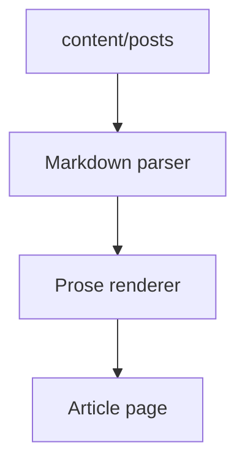

이 글은 실제 발행 원고가 아니라 `site/archive/design-system/fixtures`에 둔 렌더링 확인용 예시다. 상세 페이지의 표면은 실제 글과 같게 두되, 내용은 디자인 시스템을 검수하기 위한 더미 문장으로만 구성한다.

본문 안에서는 **굵은 글씨**, *기울임*, ==강조 표시==, [링크](https://example.com), `inline code`, <kbd>Command</kbd>+<kbd>K</kbd> 같은 인라인 요소가 자연스럽게 섞인다. 인라인 각주도 이렇게 붙는다.[^inline]

## 문제를 한 문장으로 잡기

좋은 상세 페이지는 요소가 많아져도 글의 리듬을 망치지 않아야 한다. 이미지가 들어와도, 표가 길어져도, 코드가 가로로 길어져도 독자가 어디를 읽고 있는지 잃지 않아야 한다.

> 문장 하나가 화면의 밀도를 바꾸고, 컴포넌트 하나가 글의 호흡을 바꾼다.

> [!NOTE]
> 이 예시 글은 `/articles` 목록에 나오지 않는다.
> 실제 공개 원고와 섞이지 않게 `/system/example-article/` 전용 라우트에서만 렌더링한다.

### 확인할 본문 요소

- 제목 계층은 `h2`, `h3`, `h4`까지 확인한다.
- 리스트는 기본 bullet을 쓰되 과하게 장식하지 않는다.
  - 중첩 리스트는 한 단계 안쪽으로만 들어와도 충분히 구분되어야 한다.
  - 긴 문장이 들어와도 bullet과 본문이 서로 부딪히지 않아야 한다.
- 표와 코드는 모바일에서 가로 스크롤로 빠져야 한다.

1. 먼저 글의 앞부분에서 lead paragraph가 어떻게 보이는지 본다.
2. 그 다음 표, 이미지, 코드처럼 무거운 요소의 간격을 본다.
3. 마지막으로 각주와 footer가 글 끝에서 과하게 무겁지 않은지 본다.

- [x] task list 완료 상태
- [ ] task list 미완료 상태

#### 작은 제목의 밀도

`h4`는 기존 글 호환을 위한 낮은 단계 제목이다. 새 글에서는 남발하지 않지만, 이미 들어온 글을 깨뜨리지 않기 위해 compact하게 유지한다.

## 이미지와 캡션


그림 1. Markdown source가 renderer와 prose CSS를 지나 상세 페이지가 되는 흐름.

이미지는 본문 폭을 꽉 채우되, 테두리는 얇고 캡션은 조용해야 한다. 이미지 자체가 정보라면 캡션은 장식이 아니라 독자가 무엇을 보고 있는지 잡아주는 기준점이다.

## 비교 표

| 요소 | 확인할 것 | 기대 결과 |
| --- | --- | --- |
| Cover image | post meta와 제목 사이 간격 | 16:8 비율로 조용하게 들어온다 |
| Figure | 본문 이미지와 캡션 | 이미지 폭은 본문과 맞고 캡션은 중앙 정렬 |
| Table | 모바일 overflow | 테이블만 가로 스크롤된다 |
| Code block | filename DOM 순서 | 언어가 먼저, 파일명이 나중에 나온다 |
| Footnote | 글 끝 밀도 | 본문보다 작고 얇은 rule 위에 놓인다 |

## 코드 블록

```tsx title="components/ExampleArticle.tsx"
// 상세 글에서 무거운 요소가 같은 호흡으로 들어오는지 확인한다.
type ProseElement =
  | "paragraph"
  | "figure"
  | "table"
  | "code"
  | "footnote";

export function ExampleArticle({ elements }: { elements: ProseElement[] }) {
  return (
    <article className="prose">
      {elements.map((element) => (
        <PreviewElement key={element} type={element} />
      ))}
    </article>
  );
}
```

코드 블록은 `pre`만 단독으로 보일 수도 있고, 위처럼 언어와 파일명이 붙을 수도 있다. 원본 디자인 기준은 filename 내부 DOM 순서가 `<span class="lang">tsx</span><span>components/ExampleArticle.tsx</span>` 형태라는 점이다.

## Mermaid 다이어그램



> [!WARNING]
> 이 fixture에 새 요소를 추가할 때는 renderer가 지원하는 Markdown 문법인지 먼저 확인한다.
> 실제 원고 문법을 fixture에 맞추는 방향으로 바꾸면 안 된다.

---

## 마무리

이 예시 글의 목적은 글을 잘 쓰는 것이 아니라 페이지가 오래 버틸 수 있는지 확인하는 것이다. 실제 원고를 열지 않고도 이미지, 표, 코드, 콜아웃, 리스트, 각주를 한 화면 흐름 안에서 점검할 수 있어야 한다.[^purpose]

[^inline]: 인라인 각주는 문장 흐름을 방해하지 않는 작은 표시로 남아야 한다.
[^purpose]: fixture는 발행물이 아니라 렌더링 계약을 눈으로 확인하기 위한 입력값이다.
