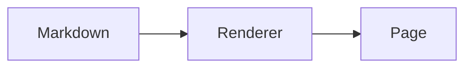

# Markdown Contract

이 문서는 `content/posts/*.md`를 site 상세 글 화면으로 렌더링할 때 필요한 변환 계약이다. compact fixture는 `../design-system/fixtures/post-markdown-fixture.md`, full post-detail fixture는 `../design-system/fixtures/example-article.md`이며, 시각 기준은 `../design-system/styles/prose.css`다.

## Goals

- 원고는 Markdown 중심으로 유지한다.
- renderer가 표현 책임을 가진다.
- 디자인을 맞추기 위해 원고에 임의 HTML을 늘리지 않는다.
- `Blog v2.html`의 상세 페이지가 보여준 prose 요소를 모두 지원한다.

## Pipeline

권장 순서:

1. frontmatter parse
2. Markdown AST parse
3. first H1 guard
4. excerpt/lead extraction
5. Markdown extensions transform
6. HTML render
7. post layout wrap

## Frontmatter And Body

- frontmatter `title`은 page title과 post heading source다.
- 본문 첫 `#`가 frontmatter `title`과 같으면 제거한다.
- `description`이 있으면 post subtitle로 쓴다.
- `description`이 없으면 첫 normal paragraph를 list excerpt로만 쓰고, post page subtitle은 생략한다.
- 첫 normal paragraph는 `.lead`로 승격할 수 있다. 단, frontmatter description에서 만든 excerpt와 같은 문장을 subtitle과 lead에 동시에 반복하지 않는다.

## Required Markdown Elements

| Markdown | Render target |
| --- | --- |
| paragraph | `.prose p` |
| first lead paragraph | `.prose p.lead` |
| `##`, `###` | `.prose h2`, `.prose h3` |
| `####` | compact `.prose h4` for existing post compatibility |
| `*em*`, `**strong**` | normal inline emphasis |
| inline code | `.prose code` |
| link | `a.link` or prose link equivalent |
| blockquote | `.prose blockquote` |
| unordered list | custom dash marker via CSS |
| ordered list | custom mono counter via CSS |
| task list | `.task-list-item`, `.checked` or `.task .done` |
| table | wrapped with `.table-scroll` |
| fenced code | `.prose pre code` |
| fenced code with filename | `.code-block > .filename + pre` |
| fenced `mermaid` diagram | `.mermaid-block > .filename + .mermaid-render + .mermaid-source` |
| image | `figure > img` |
| image caption | `figcaption` |
| footnote | `.footnotes`, `sup.fn-ref` or `sup.footnote-ref` |
| horizontal rule | `.prose hr` |
| `<kbd>` | `.prose kbd` |
| `mark` extension | `.prose mark` |

## Extensions

Source-import compatibility:

- Escaped backticks from imported posts, such as `\`` and `\`\`\``, are normalized by the renderer before Markdown parsing.
- The site does not rewrite the source post file for this compatibility step.

Callout:

```md
> [!NOTE]
> 한 줄 요약.
```

renders to:

```html
<div class="callout">
  <span class="ico">i</span>
  <div><p>한 줄 요약.</p></div>
</div>
```

Warning:

```md
> [!WARNING]
> 주의 문장.
```

renders to `.callout.warn` with `!` icon.

Code filename:

````md
```tsx title="components/Button.tsx"
type ButtonProps = {};
```
````

renders to:

```html
<div class="code-block">
  <div class="filename"><span class="lang">tsx</span><span>components/Button.tsx</span></div>
  <pre><code>...</code></pre>
</div>
```

The language chip comes first because both `Blog v2.html` and `System.html` use that DOM order.

Syntax highlight:

- Code fences with supported language names are highlighted at render time with Shiki.
- Supported language aliases include `ts`/`typescript`, `tsx`, `js`/`javascript`, `jsx`, `json`, `css`, `scss`, `bash`/`sh`/`zsh`, `html`, `md`, `yaml`, `diff`, `sql`, and `python`.
- Highlight output uses the site token classes `.tk-c`, `.tk-k`, `.tk-s`, `.tk-n`, `.tk-t`, and `.tk-f` rather than inline colors.

Mermaid diagram:

````md

````

renders to a `.mermaid-block`. The original source is kept in `.mermaid-source` as a fallback, and the client runtime renders the diagram into `.mermaid-render`.

Mark:

```md
==highlight==
```

renders to `<mark>highlight</mark>`.

Figure caption:

```md


그림 1. 설명.
```

If a paragraph immediately after an image starts with `그림 `, `Figure `, or is explicitly marked as caption by the renderer convention, wrap image and caption in one `figure`.

## QA Fixture

Renderer QA must render:

- `../design-system/fixtures/post-markdown-fixture.md`
- local-only `/system/example-article/` preview from `../design-system/fixtures/example-article.md`
- `../design-system/fixtures/component-anatomy-placeholder.svg` for the fixture figure asset
- `../design-system/fixtures/example-article-cover.svg` and `../design-system/fixtures/example-article-diagram.svg`
- at least one real post without `description`, `cover`, or `featured`
- at least one long technical post with code/table/list sections

Before shipping, compare these against the visual patterns in `../design-system/reference/blog-design/source/Blog v2.html` and `../design-system/reference/blog-design/source/System.html`.
